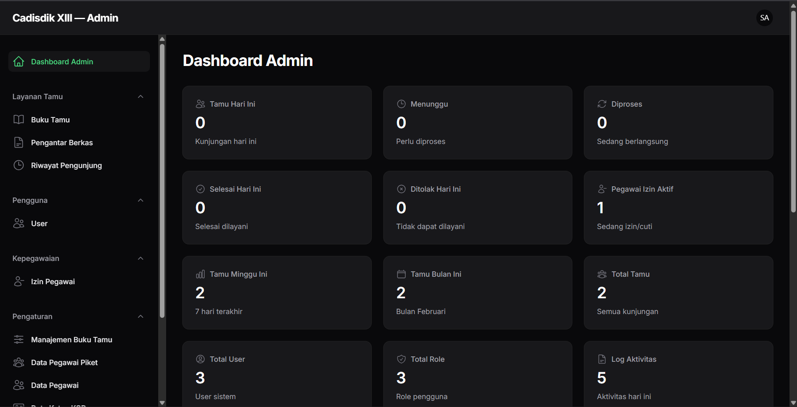
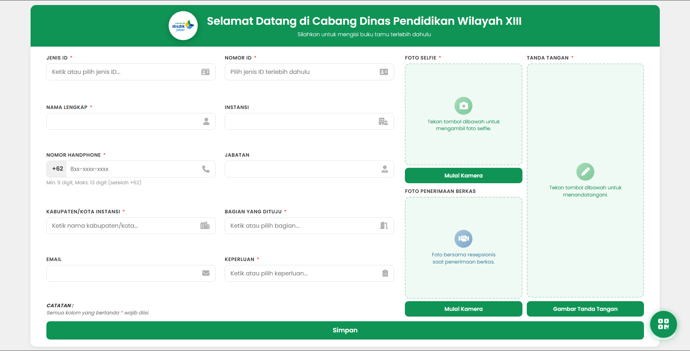

# Sistem Informasi Cadisdik XIII

<div align="center">


**Sistem Manajemen Buku Tamu & Kepegawaian**  
Cabang Dinas Pendidikan Wilayah XIII - Ciamis, Jawa Barat

[Demo](#demo) • [Fitur](#fitur-utama) • [Instalasi](#instalasi) • [Dokumentasi](#dokumentasi) • [Team](#team)

</div>

---

## Tentang Project

Sistem Informasi Cadisdik XIII adalah aplikasi berbasis web yang dirancang untuk mengelola administrasi buku tamu dan kepegawaian di Cabang Dinas Pendidikan Wilayah XIII Ciamis. Aplikasi ini menyediakan fitur lengkap mulai dari registrasi tamu, manajemen izin pegawai, hingga pelaporan dan pencetakan dokumen resmi.

### Tujuan Project

- Digitalisasi proses administrasi buku tamu
- Otomatisasi manajemen izin pegawai
- Monitoring aktivitas pegawai piket
- Pelaporan dan dokumentasi yang terstruktur
- Meningkatkan efisiensi layanan administrasi

---

## Fitur Utama

### Landing Page (Public)

- **Registrasi Tamu Digital**
    - Form registrasi dengan validasi NIK
    - Upload foto selfie dengan kamera
    - Pilihan keperluan dan bagian yang dituju
    - Auto-fill untuk tamu berulang (berdasarkan NIK)
    - QR Code untuk survei kepuasan (SKM)

### Panel Pegawai Piket

- **Manajemen Kunjungan Tamu**
    - Lihat daftar tamu yang masuk
    - Update status kunjungan (Proses/Selesai)
    - Tambah catatan kunjungan
    - Input nama penerima tamu
    - Print detail kunjungan individual
    - Cetak laporan bulk dengan filter tanggal/status

- **Manajemen Izin Pegawai**
    - Input izin pegawai (sakit, cuti, dinas luar, dll)
    - Upload surat izin/dokumen pendukung
    - Auto-generate nomor surat
    - Print surat izin resmi dengan tanda tangan digital

- **Data Master**
    - Manajemen data pegawai (CRUD)
    - Data pegawai piket
    - Dropdown options (jenis ID, keperluan, kabupaten, bagian)
    - Print data pegawai & jadwal piket

- **Dashboard & Statistik**
    - Statistik kunjungan tamu (hari ini, minggu ini, bulan ini)
    - Grafik tren kunjungan
    - Status izin pegawai
    - Quick access menu

### Panel Ketua KCD

- Semua fitur Pegawai Piket
- **Approval Izin Pegawai**
    - Review dan approve/reject izin
    - Komentar approval
- **Riwayat Pengunjung**
    - Laporan lengkap semua kunjungan
    - Filter & pencarian advanced
- **Dashboard Analytics** yang lebih detail

### Panel Super Admin

- Semua fitur Ketua KCD
- **Manajemen User**
    - CRUD users (Piket, Ketua KCD, Admin)
    - Assign roles
    - Aktivasi/deaktivasi akun
- **Pengaturan Sistem**
    - Data Ketua KCD (nama, NIP, jabatan)
    - Upload barcode SKM
    - Konfigurasi dropdown options
- **Log Aktivitas**
    - Tracking semua aktivitas user (CRUD, login, print)
    - Filter log berdasarkan user, modul, aksi, periode
    - Print log aktivitas dengan filter
- **FAQ Management**

---

## Tech Stack

### Backend

- **Framework**: Laravel 11.48.0
- **Admin Panel**: Filament 3.x
- **Authentication**: Laravel Breeze + Filament Shield
- **Activity Log**: Spatie Laravel Activitylog 4.11
- **Database**: MySQL 8.0+

### Frontend

- **CSS Framework**: Tailwind CSS 3.x
- **JavaScript**: Alpine.js (via Filament)
- **Icons**: Heroicons
- **Forms**: Livewire 3.x

### Development Tools

- **Package Manager**: Composer, NPM
- **Build Tool**: Vite
- **Version Control**: Git
- **CI/CD**: GitHub Actions

### Server Requirements

- PHP 8.2 or higher
- MySQL 8.0 or MariaDB 10.3+
- Composer 2.x
- Node.js 18+ & NPM
- Git

---

## Instalasi

### 1. Clone Repository

```bash
git clone https://github.com/buku-tamu-kcd-ciamis/buku-tamu-kcd-ciamis.git cadisdik-xiii
cd cadisdik-xiii
```

### 2. Install Dependencies

```bash
# Install PHP dependencies
composer install

# Install NPM dependencies
npm install
```

### 3. Environment Configuration

```bash
# Copy .env example
cp .env.example .env

# Generate application key
php artisan key:generate
```

### 4. Database Setup

Edit file `.env` dengan credentials database Anda:

```env
DB_CONNECTION=mysql
DB_HOST=127.0.0.1
DB_PORT=3306
DB_DATABASE=cadisdik_db
DB_USERNAME=root
DB_PASSWORD=
```

Jalankan migrasi dan seeder:

```bash
php artisan migrate --seed
```

### 5. Storage Link

```bash
php artisan storage:link
```

### 6. Build Assets

```bash
npm run build
```

### 7. Jalankan Development Server

```bash
php artisan serve
```

Akses aplikasi di `http://localhost:8000`

### 8. Default Credentials

| Role        | Email                | Password   |
| ----------- | -------------------- | ---------- |
| Super Admin | `admin@cadisdik.com` | `password` |
| Ketua KCD   | `ketua@cadisdik.com` | `password` |
| Piket       | `piket@cadisdik.com` | `password` |

---

## Penggunaan

### Public Landing Page

1. Buka `http://localhost:8000`
2. Isi form registrasi tamu
3. Ambil foto selfie
4. Submit form
5. Scan QR Code untuk survei kepuasan

### Admin Panel

1. **Piket**: `http://localhost:8000/piket`
2. **Ketua KCD**: `http://localhost:8000/kcd`
3. **Super Admin**: `http://localhost:8000/admin`

Login menggunakan credentials default atau yang sudah dibuat.

---

## Dokumentasi

### Deployment

- [Panduan Deployment Umum](docs/deployment/DEPLOYMENT.md)
- [Deployment ke ISPConfig](docs/deployment/ISPCONFIG_DEPLOYMENT.md)
- [Deployment Checklist](docs/deployment/DEPLOYMENT_CHECKLIST.md)
- [Deploy Script](docs/deployment/deploy.sh)

### Database Schema

```
├── users                      # User accounts
├── role_users                 # User roles
├── buku_tamus                 # Guest book entries
├── pegawai_izins              # Employee leave/permit
├── pegawais                   # Employee master data
├── dropdown_options           # System dropdowns
├── pengaturan_kcd             # KCD head settings
└── activity_log               # System activity logs
```

### API Endpoints

```
GET  /api/dropdown-options/{category}  # Get dropdown options
GET  /api/guest-by-nik?nik={nik}       # Get guest by NIK
POST /                                  # Submit guest registration
```

---

## Deployment

Project ini sudah dilengkapi dengan GitHub Actions untuk CI/CD automation.

### Prerequisites

- Server dengan SSH access
- PHP 8.2+, Composer, MySQL, Git
- Domain/subdomain yang sudah pointing

### Quick Deployment

1. Setup server sesuai [DEPLOYMENT.md](docs/deployment/DEPLOYMENT.md)
2. Tambahkan GitHub Secrets:
    - `SSH_HOST`, `SSH_USERNAME`, `SSH_KEY`, `SSH_PORT`, `PROJECT_PATH`
3. Push ke branch `main`
4. GitHub Actions akan otomatis deploy

Detail: Lihat [DEPLOYMENT.md](docs/deployment/DEPLOYMENT.md) dan [ISPCONFIG_DEPLOYMENT.md](docs/deployment/ISPCONFIG_DEPLOYMENT.md)

---

## Team

Project ini dikembangkan oleh siswa RPL SMKN 1 Ciamis:

<table>
  <tr>
    <td align="center">
      <br />
      <sub><b>Muhammad Fikri Haikal</b></sub><br />
      <sub>Project Lead & Full Stack Developer</sub><br />
      <sub>System Architecture & Backend Development</sub>
    </td>
    <td align="center">
      <br />
      <sub><b>Galuh Surya Putra</b></sub><br />
      <sub>Frontend Developer</sub><br />
      <sub>UI/UX & Interface Design</sub>
    </td>
    <td align="center">
      <br />
      <sub><b>Rasya MZ</b></sub><br />
      <sub>System Designer & QA</sub><br />
      <sub>Planning & Quality Assurance</sub>
    </td>
  </tr>
</table>

### Institusi

- **Cabang Dinas Pendidikan Wilayah XIII**  
  Jl. Mr. Iwa Kusumasomantri No. 12, Ciamis, Jawa Barat 46211

### Contact

- **Email**: cadisdik13@disdik.jabarprov.go.id
- **Phone**: (0265) 771045
- **Website**: [cadisdik13.disdik.jabarprov.go.id](#)

---

## Contributing

Contributions, issues, and feature requests are welcome!

1. Fork the project
2. Create your feature branch (`git checkout -b feature/AmazingFeature`)
3. Commit your changes (`git commit -m 'Add some AmazingFeature'`)
4. Push to the branch (`git push origin feature/AmazingFeature`)
5. Open a Pull Request

---

## License

This project is **proprietary** software developed for Cabang Dinas Pendidikan Wilayah XIII Ciamis.

All rights reserved © 2026 Cadisdik XIII

---

## Acknowledgments

- **Laravel Team** - For the amazing PHP framework
- **Filament Team** - For the beautiful admin panel
- **Spatie** - For the excellent Laravel packages
- **Cadisdik XIII** - For the opportunity and support
- **All contributors** - For making this project possible

---

## Project Statistics

- **Lines of Code**: ~15,000+
- **Models**: 8
- **Controllers**: 4
- **Migrations**: 15+
- **Filament Resources**: 12
- **Development Time**: 3 months
- **Version**: 1.0.0

---

## Changelog

### Version 1.0.0 (February 2026)

- Initial release
- Guest book management system
- Employee leave management
- Multi-role authentication (Piket, KCD, Admin)
- Dynamic signature system
- Activity logging
- Print/PDF generation
- Barcode SKM upload
- CI/CD with GitHub Actions

---

## Screenshots

### Landing Page


### Admin Dashboard



### Buku Tamu



### Izin Pegawai


---

<div align="center">

**Developed by Tim Developer Cadisdik XIII**

© 2026 Cabang Dinas Pendidikan Wilayah XIII

[Kembali ke atas](#sistem-informasi-cadisdik-xiii)

</div>
